# CCNA College Campus Network

## 📌 Project Overview
Advanced 4-floor College Campus Network Design using Cisco Packet Tracer.

---

# 🖼 Project Screenshots

## 🗺 Network Topology
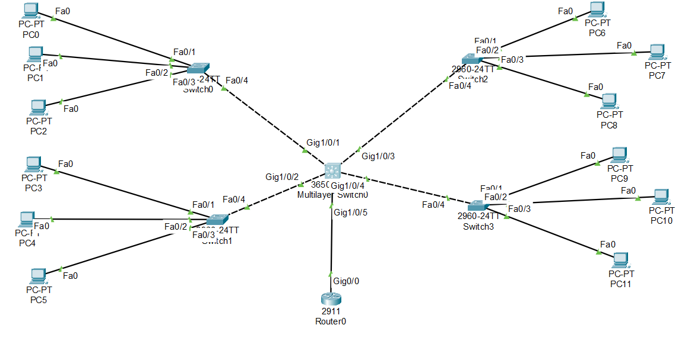

## 🌐 VLAN Configuration
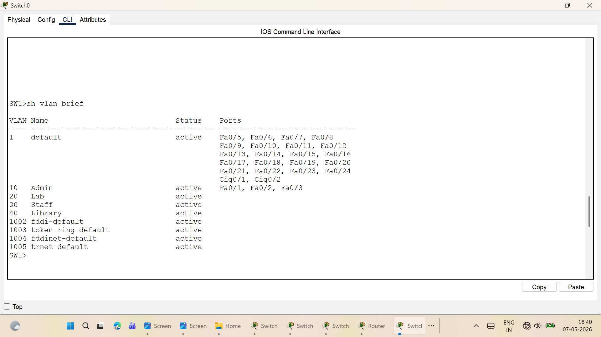

## 🔀 Trunk Configuration
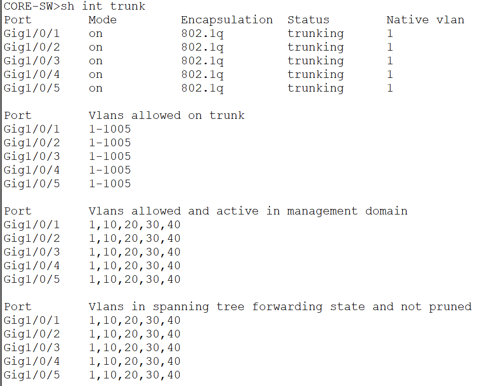

## 📡 VTP Client Configuration
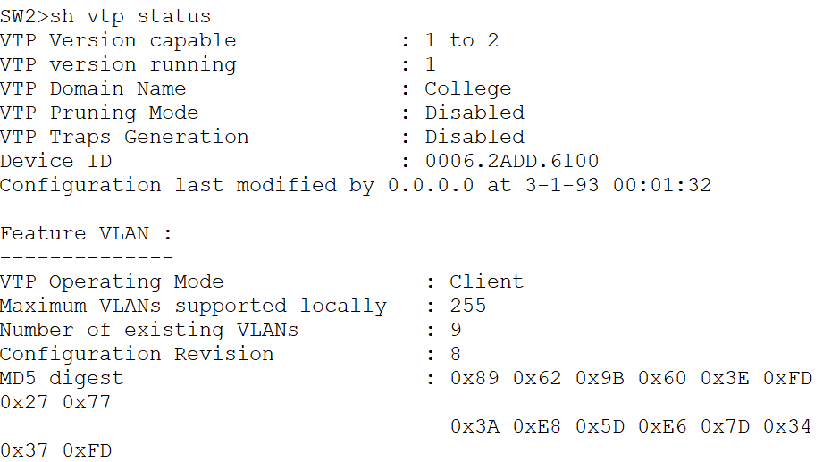

## 📊 VTP Status
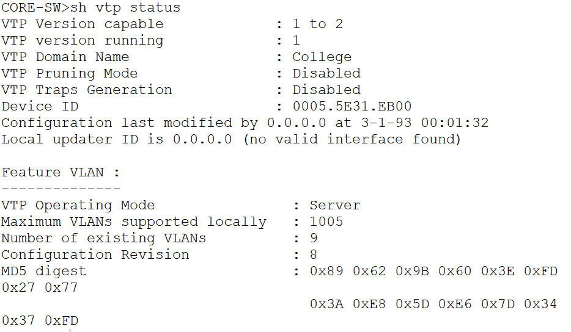

## 🔒 Access List Configuration
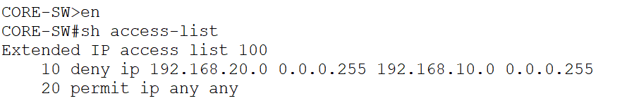

## 🛡 Port Security Configuration
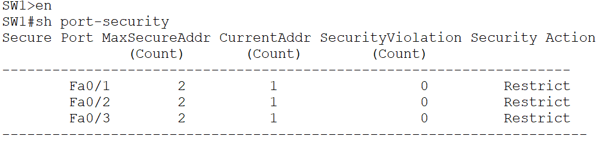

## 📶 Ping Verification
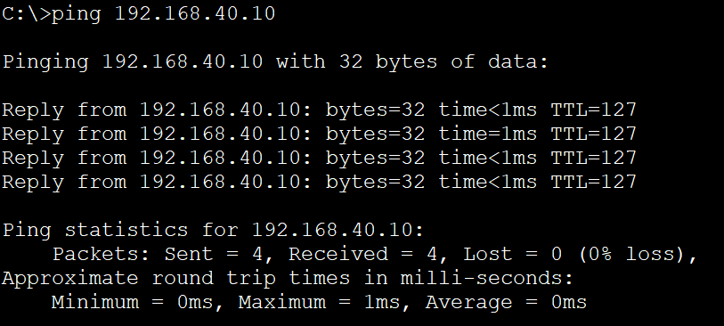

## 📋 Interface Brief
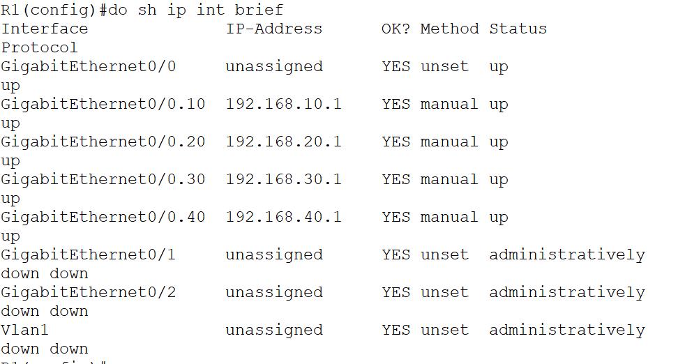

## ⚙ Router Configuration 1
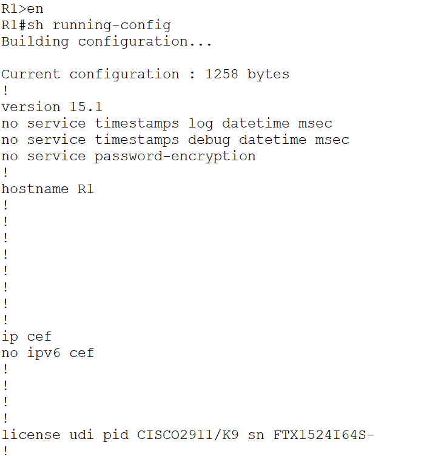

## ⚙ Router Configuration 2
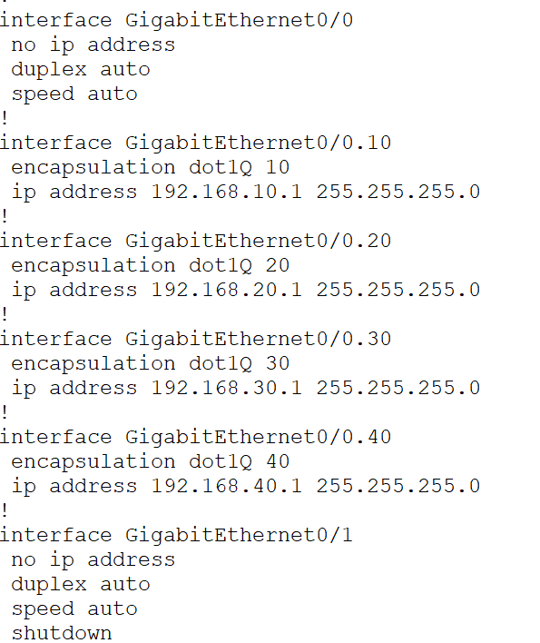

## ⚙ Router Configuration 3
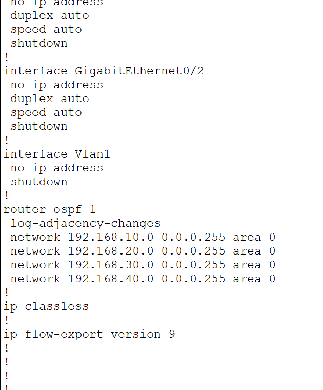

---

# 🛠 Technologies Used
- VLAN
- InterVLAN Routing
- VTP
- OSPF
- ACL
- Port Security
- Trunking

---

# 🚀 Features
- Secure Network Segmentation
- Dynamic Routing using OSPF
- InterVLAN Communication
- Access Control Security
- Port Security Implementation
- VLAN Management using VTP

---

# 🧰 Tools Used
- Cisco Packet Tracer

---

# 👩‍💻 Author
Shreya Madane
